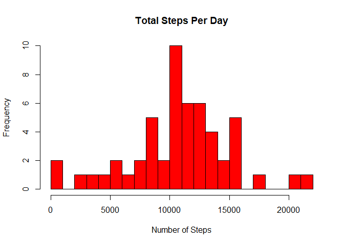
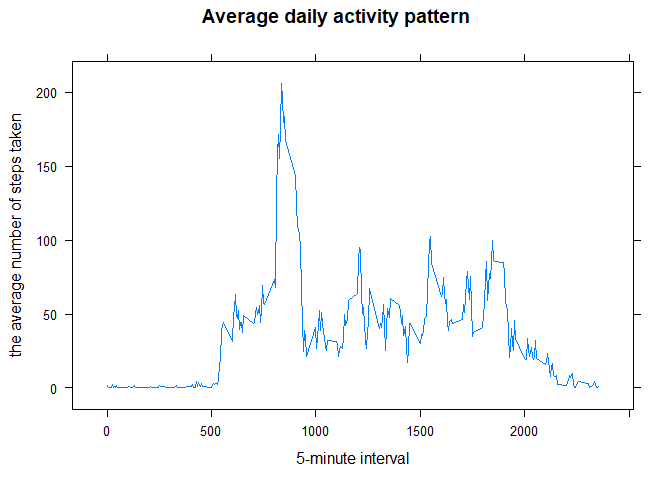
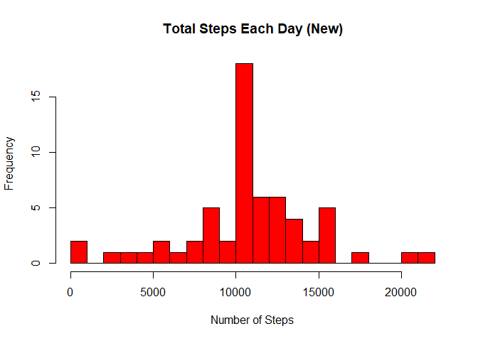
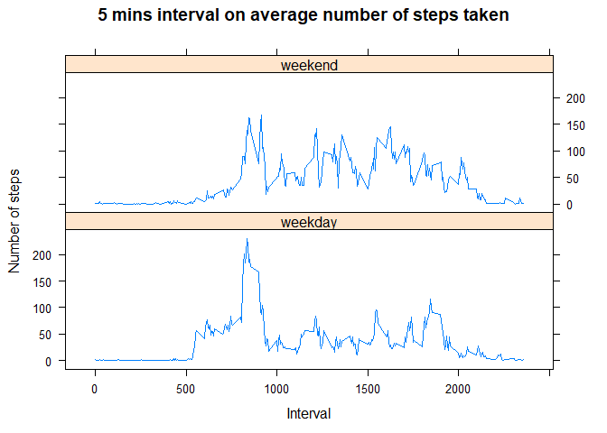

---
title: "Reproducible Research: Peer Assessment 1"
author: "Willianto Asalim"
output: 
  html_document:
    keep_md: true
---


```r
## Setting Global Option where echo = true so that someone will be able to read the code and results.
knitr::opts_chunk$set(echo = TRUE, results = "asis", tidy = TRUE)
```


## Loading and preprocessing the data

```r
## Create csv filename activity and download data from the link provided then unzip the file.
if (!file.exists("activity.csv") )
{
  url <- 'https://d396qusza40orc.cloudfront.net/repdata%2Fdata%2Factivity.zip'  
  download.file(url, destfile='repdata-data-activity.zip', mode='wb')  
  unzip('repdata-data-activity.zip')
}

## Read, assign data and classes on each column.
data <- read.csv("activity.csv", header = TRUE, sep = ",", na.strings = "NA", colClasses=c("numeric", "character", "numeric"))
```

------------------------------------------------------

## What is mean total number of steps taken per day?
1. Calculate the total number of steps taken per day

```r
stepsByDay <- aggregate(steps ~ date, data=data, sum)
```

2. Make a histogram of the total number of steps taken each day

```r
hist(stepsByDay$steps, breaks = 20, main = paste("Total Steps Per Day"), col="red",xlab="Number of Steps")
```

<!-- -->

3. Calculate and report the mean and median of the total number of steps taken per day

```r
## Calculate mean steps
meanSteps <- mean(stepsByDay$steps)
meanSteps
```

[1] 10766.19

```r
## Calculate median steps
medianSteps <- median(stepsByDay$steps)
medianSteps
```

[1] 10765


**Ans: The mean total number of steps taken per day is 1.0766189\times 10^{4} and the median total number of steps taken per day 1.0765\times 10^{4}.**

----------------------------------------------------------

## What is the average daily activity pattern?
1. Make a time series plot (i.e. type="l") of the 5-minute interval (x-axis) and the average number of steps taken, averaged across all days (y-axis)

```r
## To make this plot we need to perform aggreate by steps and intervals, returning means and removing all the na values.
intervalSteps <- aggregate(x= list(steps = data$steps), by =list(interval = data$interval), FUN = mean, na.rm = TRUE)

## Plot the time series using xyplot with type "l".
xyplot(intervalSteps$steps ~ intervalSteps$interval, type = "l", xlab ="5-minute interval", ylab = "the average number of steps taken", main = "Average daily activity pattern")
```

<!-- -->

2. Which 5-minute interval, on average across all the days in the dataset, contains the maximum number of steps?


```r
##Using which.max to find out the maximum number of steps.
maxIntervalSteps <- intervalSteps[which.max(intervalSteps$steps),]
maxIntervalSteps
```

    interval    steps
104      835 206.1698

**Ans: The 5 minute interval with maximum number of steps is at 835 interval and the maximum of 206.1698113 steps.**

----------------------------------------------------

## Imputing missing values
1. Calculate and report the total number of missing values in the dataset (i.e. the total number of rows with NAs)

```r
##Calculate the total number of missing values in the data.
missingSteps <- sum(is.na(data))
missingSteps
```

[1] 2304

**Ans: The total number of missing values in the dataset is 2304.**

2. Devise a strategy for filling in all of the missing values in the dataset. The strategy does not need to be sophisticated. For example, you could use the mean/median for that day, or the mean for that 5-minute interval, etc.

```r
## Using for loop to search all rows and assign new data to the missing data using the aggregate factor variable created previously.
newData <- function(data){
        for (i in 1:nrow(data)){
                if(is.na(data[i,1])){
                        data[i,"steps"] <- intervalSteps[intervalSteps$interval == data[i,"interval"],"steps"] 
                }
        }
        return(data)
}
```

3. Create a new dataset that is equal to the original dataset but with the missing data filled in.

```r
filledData <- newData(data)
```

4. Make a histogram of the total number of steps taken each day and Calculate and report the mean and median total number of steps taken per day. Do these values differ from the estimates from the first part of the assignment? What is the impact of imputing missing data on the estimates of the total daily number of steps?

```r
## To make this histogram we need to perform aggreate by steps and date from the filledData, returning sum(total steps each day).
newSteps <- aggregate(steps ~ date, data=filledData, sum)

## Create the histogram using the aggregrated factor variable.
hist(newSteps$steps, breaks = 20, main = paste("Total Steps Each Day (New)"), col="red",xlab="Number of Steps")
```

<!-- -->


```r
## Assigning new mean steps
newMeanSteps <- mean(newSteps$steps)
newMeanSteps
```

[1] 10766.19

```r
## Assigning new median steps
newMedianSteps <- median(newSteps$steps)
newMedianSteps
```

[1] 10766.19

```r
##Calculating the difference of new median steps from the previous median steps
diffMedianSteps <- newMedianSteps - medianSteps 
diffMedianSteps
```

[1] 1.188679

**Ans: The new mean steps is 1.0766189\times 10^{4} and the new median steps is 1.0766189\times 10^{4}**

**Judging from the new values, there are no difference in mean steps but a difference in median steps by 1.1886792**

---------------------------------------------------

## Are there differences in activity patterns between weekdays and weekends?
1. Create a new factor variable in the dataset with two levels – “weekday” and “weekend” indicating whether a given date is a weekday or weekend day.

```r
## Create a new factor variable for weekday name in a new column named day.
filledData$day <- weekdays(as.Date(filledData$date))

## Create a new factor variable using if else whether the day is weekday or weekend in a new column named daytype.
filledData$daytype <- ifelse(weekdays(as.Date(filledData$date)) %in% c("Saturday","Sunday"), "weekend", "weekday")
```

2. Make a panel plot containing a time series plot (i.e. type="l") of the 5-minute interval (x-axis) and the average number of steps taken, averaged across all weekday days or weekend days (y-axis). See the README file in the GitHub repository to see an example of what this plot should look like using simulated data.

```r
## Create a new factor variable using aggregate by steps and interval, returning mean. 
meanSteps <- aggregate(filledData$steps, list(as.numeric(filledData$interval), filledData$daytype), FUN = "mean")

## Assign name on each column
names(meanSteps) <- c("interval","weekDays", "avgSteps")

## Create xyplot of 5 mins interval and avg steps with type="l" showing weekdays and weekends.
xyplot(meanSteps$avgSteps ~ meanSteps$interval | meanSteps$weekDays, 
       layout = c(1, 2), type = "l", 
       xlab = "Interval", ylab = "Number of steps", main = "5 mins interval on average number of steps taken")
```

<!-- -->


